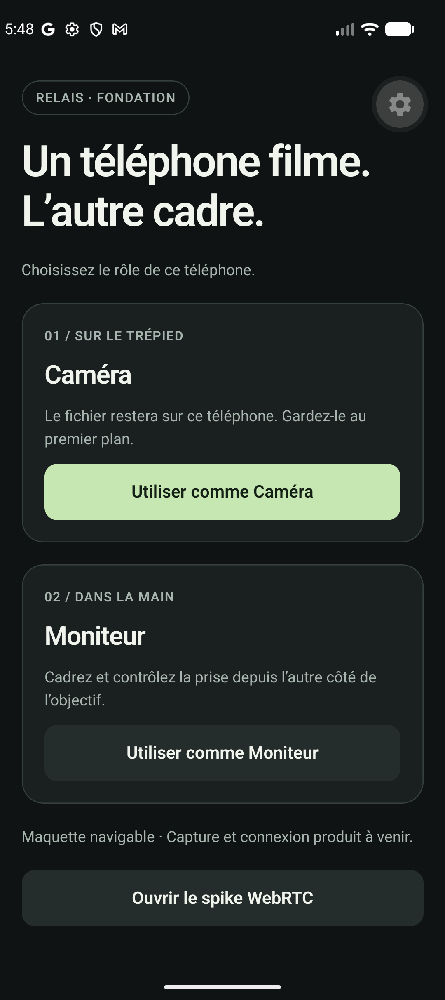
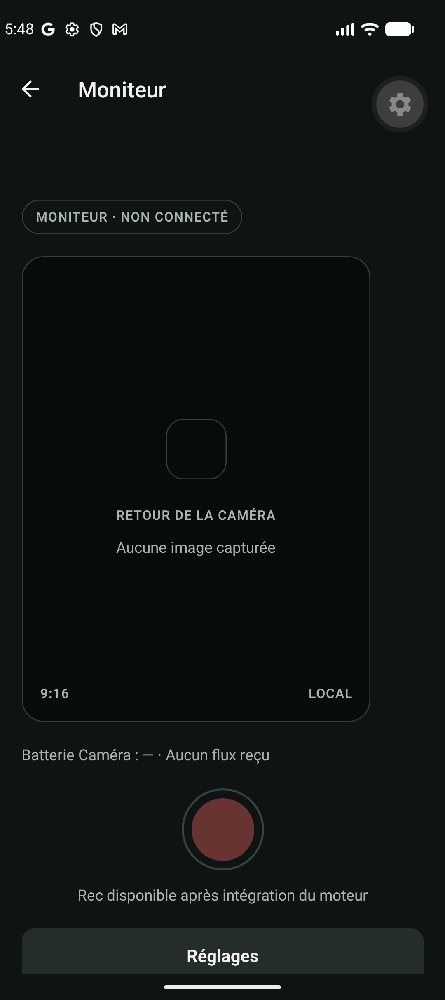
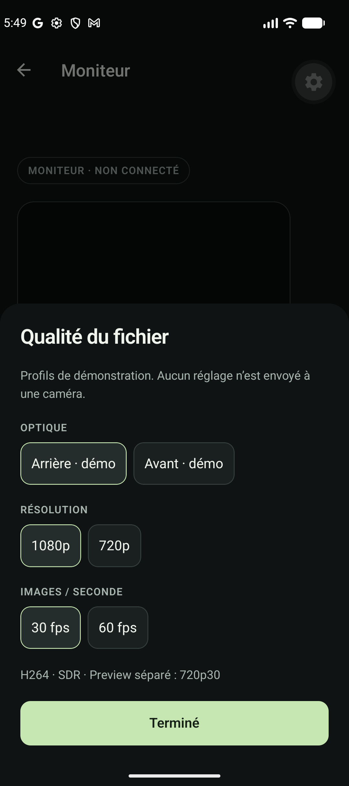

# Historical Android UI audit evidence

Captured September 9, 2026 on foundation build `3f82cd1`: Pixel_10 AVD, Android 16/API 36, image 36.1 arm64, 1080 × 2424. Package app.relais.mobile, debug Dev Client with Metro on 8087. No product sensor was active. These original screenshots/XML retain French labels as historical evidence; the current interface is English.

The user journey was choosing a role, monitoring framing and accessing settings without losing essential controls. This was a focused UX/accessibility-label audit, not accessibility certification.

## 1. Home — improvement needed



Roles and purposes were explicit. Large cards, custom typography and shared-platform buttons looked like a prototype. Proposed direction: compact native sections/actions. The Tools wheel belongs to Expo Dev Client.

## 2. Monitor — priority



Disconnected state and unavailable recording were clear. Settings was partly clipped below the initial viewport. The viewfinder lived in the global ScrollView; its stated 9:16 aspect differed from the code's 9/12. Proposed direction: fixed viewfinder, anchored controls, accurate aspect and remote-source label.

## 3. Settings — priority



Groups were readable and demo profiles labeled. Selection used a colored outline/surface instead of a native checkmark. There was no drag indicator. Swiping down from the upper edge did not dismiss; Android Back did and restored Monitor. Proposed direction: actual native sheet and platform selectors.

The [after-swipe screenshot](04-after-swipe.png) confirms the sheet remained visible. Matching XML files preserve each state; `05-after-back.xml` contains Monitor after Back and no quality-sheet title.

## Recorded protocol

```sh
CI=1 pnpm exec expo start --dev-client --localhost --port 8087
emulator -avd Pixel_10 -read-only -no-snapshot -no-audio
adb -s emulator-5554 install -r e2e/artifacts/relais-debug-arm64.apk
adb -s emulator-5554 reverse tcp:8087 tcp:8087
adb -s emulator-5554 shell am start -W -a android.intent.action.VIEW \
  -d 'relais://expo-development-client/?url=http%3A%2F%2F127.0.0.1%3A8087' app.relais.mobile
adb -s emulator-5554 shell am start -W -a android.intent.action.VIEW \
  -d 'relais://monitor' app.relais.mobile
adb -s emulator-5554 shell uiautomator dump /sdcard/relais-audit.xml
adb -s emulator-5554 exec-out screencap -p > capture.png
adb -s emulator-5554 shell input tap 540 2305
adb -s emulator-5554 shell input swipe 540 967 540 1850 500
adb -s emulator-5554 shell input keyevent 4
```

The tap targeted Settings using UIAutomator coordinates. Screenshots/XML were captured at each state. adb/emulator came from the local `~/Library/Android/sdk/`. Metro and the emulator were stopped after this audit.

## Evidence limits

- iOS was reviewed through documentation/shared code only at this date; no running SwiftUI/iPhone capture.
- Pixel/Apple Camera references came from official documentation, not an audit on physical phones.
- UIAutomator Button/RadioButton classes report accessibility roles, not proof of Material widgets. The original code used Pressable.
- TalkBack, VoiceOver, measured contrast, large text, keyboard and rotation were not tested here.
- No performance measurement, real video preview or recording-time interaction was tested.

Decision and sources: [native iOS and Android interface](../../native-ui-ux.md).
