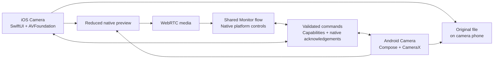

# Platform camera ownership and shared remote control

Decision and source review: September 11, 2026.

## Decision

Keep two specialized camera implementations and one shared Monitor/protocol. A camera's public native capabilities determine its controls, regardless of the Monitor's OS. Sharing the command model must not reduce an iPhone to Android's feature set, or vice versa.

Relais already had separate native owners. This change makes their TypeScript boundaries explicit instead of exposing Android-only and iOS-only methods through one misleading universal module:

| Responsibility         | iOS                                                    | Android                                                                          |
| ---------------------- | ------------------------------------------------------ | -------------------------------------------------------------------------------- |
| Camera entry           | `src/screens/Camera.ios.tsx`                           | `src/screens/Camera.android.tsx`                                                 |
| Product native binding | `modules/relais-camera-engine/src/ios/CameraModule.ts` | `modules/relais-camera-engine/src/android/CameraModule.ts`                       |
| Capture owner          | Swift `AppleCameraModel`, AVFoundation                 | `src/android/LocalCamera.tsx` inside the module, VisionCamera 5.2.3 over CameraX |
| Camera presentation    | SwiftUI and SF Symbols                                 | Jetpack Compose/Material and Material Symbols through Expo UI                    |
| Original media         | AVFoundation outputs → PhotoKit                        | CameraX outputs → MediaStore                                                     |
| Gallery access         | PhotosPicker and Quick Look                            | Android Photo Picker and a native viewer for the selected URI                    |
| Preview adapter        | `src/transport/native/previewTrack.ios.ts`             | `src/transport/native/previewTrack.android.ts`                                   |

`src/capture/` owns validated settings, commands, acknowledgements and optimistic selection. `PeerSession` owns WebRTC and the paired DataChannel. Monitor shares screen semantics and native presentation components. Neither depends on a specific camera implementation. Boundary checks reject cross-platform camera imports and platform-specific dependencies in the shared command layer. The old module index now describes only the historical fixture API.

Frames remain native. Only small control messages and state cross JavaScript. Recording remains independent of network disconnection. Keep native navigation and settings controls; reproduce the camera layout where no public stock-camera component exists. Do not introduce a second camera owner to add a feature.

## Why an advertised mode may be missing

There are three different limits: hardware, public APIs, and the combinations supported by the active capture session. A product specification is not a list of modes a third-party app can safely enable.

- **Pixel 8K:** Google's documented 8K workflow uses Video Boost, with Google Photos backup and cloud processing, up to 30 fps. No public Video Boost capture API was found in the reviewed Android camera documentation. Relais cannot expose this as a normal local CameraX recording switch. This is a limitation of the available integration, not evidence that every Android device is incapable of native 8K. [Google Video Boost](https://support.google.com/pixelcamera/answer/14257322?hl=en).
- **CameraX video:** the pinned 1.7.0-alpha03 API includes UHD/4K and the new QHD/1440p tier. Relais previously ignored QHD; it now maps that tier. A choice is still advertised only after validation with Preview, VideoCapture and the relay ImageAnalysis output at the requested cadence and dynamic range. CameraX warns that extra simultaneous use cases can restrict combinations. [Quality reference](https://developer.android.com/reference/androidx/camera/video/Quality), [video capture](https://developer.android.com/media/camera/camerax/video-capture).
- **Photo extensions:** Android's vendor extensions can provide HDR, Night and Bokeh on supported devices. They apply to preview and still capture, not video. They are not implemented in Relais yet; enabling them requires validating the extension session with the relay output. [Camera extensions](https://developer.android.com/media/camera/camera-extensions).
- **Apple Cinematic:** iOS 26 has public capture APIs, which the existing Swift owner already integrates. It is a real platform-specific capability, not an effect implemented in JS. ProRes/Log/RAW and external recording are separate integrations and remain unimplemented. [Apple Cinematic capture](https://developer.apple.com/documentation/avfoundation/capturing-cinematic-video).

The Android photo owner already requests quality-prioritized capture and an approximately 50 MP target. VisionCamera's installed native implementation prefers higher resolution over capture rate. That is a request, not a guarantee: the output's actual dimensions remain authoritative. Ultra HDR/JPEG gain maps, RAW and vendor extensions require their own supported-format/session handling; they must not be represented by decorative switches.

## Changes delivered in this pass

- Explicit platform camera bindings, Android-only owner/screen, and native preview adapters. The shared wire format and pairing identities are unchanged.
- “Best available” now chooses the highest advertised resolution, then its highest advertised frame rate. It no longer uses 4K60 as a fixed target. HDR preference breaks equivalent-profile ties; resolution/frame rate take priority. Balanced remains approximately 1080p30 and Keep camera settings remains unchanged. Higher cadence is not automatically an edited slow-motion movie, and a numerical maximum is not a guarantee of the best low-light image.
- QHD profiles are included when CameraX validates them. The installed VisionCamera quality selector also discovers CameraX's available tiers dynamically.
- Android's local video settings now expose the existing native stabilization setting, also available remotely. Native profile validation is repeated when stabilization changes; the UI does not manufacture resolution/FPS/HDR combinations.
- Android gallery now opens the native Photo Picker using an Activity Result contract. Cancel is a no-op; repeat taps cannot stack pickers. Selection grants access to that URI and opens the appropriate native viewer. There is no Google Photos package dependency and no broad library permission. The system contract provides its documented fallback on older supported Android versions. [Android Photo Picker](https://developer.android.com/training/data-storage/shared/photo-picker).

The previous gallery intent does resolve to Google Photos on the connected Pixel. Therefore, a missing gallery app is not an established root cause of the user's report. The new picker makes selection and return explicit, but a report of missing captured files must still be distinguished from failure to open the gallery. The existing MediaStore finalization and retained-file recovery remain in place.

## Communication and responsiveness

Keep WebRTC for preview media and its reliable, ordered DataChannel for camera commands. A second WebSocket or Bluetooth control link would introduce another lifecycle and reconciliation problem without evidence that transport RTT is the current bottleneck.

The existing optimistic queue gives immediate selection feedback, serializes camera reconfiguration and coalesces superseded values. The camera's acknowledgement remains authoritative for applied settings, capture start and gallery completion. Native failures roll back pending UI; stale connection replies cannot affect a new peer. Resolution, lens and HDR changes can require a sensor/encoder restart, so zero physical latency is not an achievable contract. [Queue behavior and regression evidence](../remote-settings-performance.md).

Future native features should extend the typed capability/action contract explicitly: advertise only supported choices, attach them to the native catalog revision, validate on the capture phone, and acknowledge the actual applied result. Optional capabilities such as iOS Cinematic can be operated by either Monitor OS; do not branch on the Monitor's hardware to decide what the remote camera supports. Changing wire semantics requires a versioned compatibility decision, not arbitrary native-method names sent over the network.

## Next native capability work

1. Capture an actual capability report on each lens: available formats, valid relay combinations, applied file dimensions/cadence/dynamic range and reasons for rejected combinations. Device names alone cannot establish these facts.
2. Implement Android Ultra HDR photos or a vendor extension only after proving support with the single-owner relay session. Check actual encoded output and gallery import before exposing the option remotely.
3. If a required public API cannot be expressed through VisionCamera, replace the Android owner incrementally with direct Kotlin CameraX/Camera2 behind its existing adapter. Preserve protocol, preview bridge, MediaStore recovery and native callbacks. Renaming code or replacing React Native alone does not unlock Google Camera's proprietary processing.
4. Measure native configuration time separately from DataChannel RTT and UI response. Optimize the slow stage identified by those measurements. If simultaneous preview blocks a desired capture format, investigate native stream topology before offering a separate local-only mode; never silently degrade the original file.

No dependency upgrade or speculative full camera rewrite is part of this pass. This leaves a bounded, reviewable foundation for adding actual native capabilities.

## Acceptance and remaining evidence

Android → Android, iOS → iOS and both cross-platform directions use the same control/preview contract; arrows identify Camera → Monitor. This architectural support does not certify four physical-device combinations. Only one phone per OS is currently available, and physical capture acceptance remains owner-run.

For each available direction, connect both open apps on the same LAN, change a supported video profile from Monitor, confirm it on Camera, take a photo and a short video, and inspect their original dimensions in the camera phone's gallery. Compare a network disconnect during recording with local stop/finalization. On Android, also check gallery cancel, selecting a photo/video, and return to Camera. The [relay test guide](../relay-testing.md) covers the broader matrix. Build/install evidence belongs in [STATUS](../../STATUS.md); compiling is not proof of image quality or sensor-mode availability.
